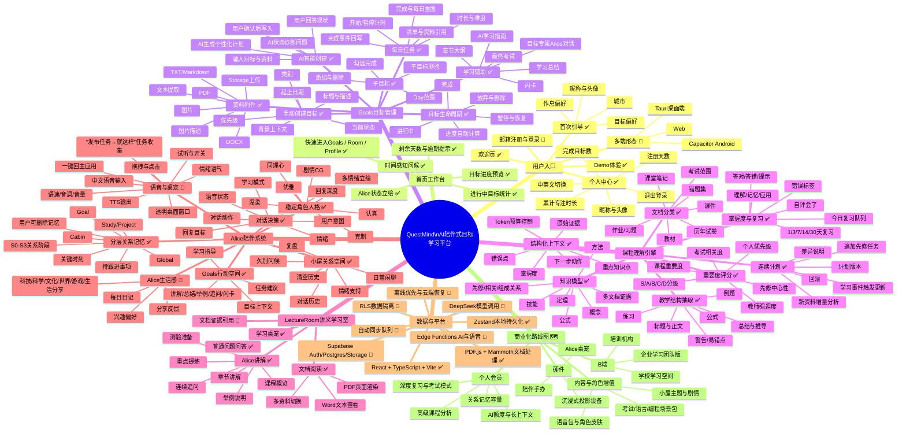

# QuestMind 功能描述思维导图

> 代码依据：`src/pages`、`src/services`、`src/course-engine`、`src/store`、`supabase/schema.sql`。
> 状态口径：✅ 已有页面或服务实现；🧪 代码已具备但需要真实环境验收；🗺️ 适合放入后续产品路线图。



## 代码支持的核心用户旅程

```text
进入产品 → Demo或注册登录 → 首次引导 → 输入目标
→ Alice追问当前状态 → 上传教材/课件/试卷
→ 生成目标、子目标、每日任务与学习地图
→ 今日任务与专注计时 → 讲义学习室阅读和提问
→ 小测/最终考试验证 → 掌握度与复习队列更新
→ 计划持续修订 → 目标完成庆祝 → Alice在小屋中持续陪伴
```

## 对外表述边界

当前可以对外讲“核心产品原型和技术路线已经形成”。商业化、真实用户规模、付费转化、生产环境云端部署、AI成本和桌宠交互仍应作为融资后验证目标；数据库中遗留的金币、排行榜、任务和房间物品表不能直接等同于已上线的游戏化闭环。
